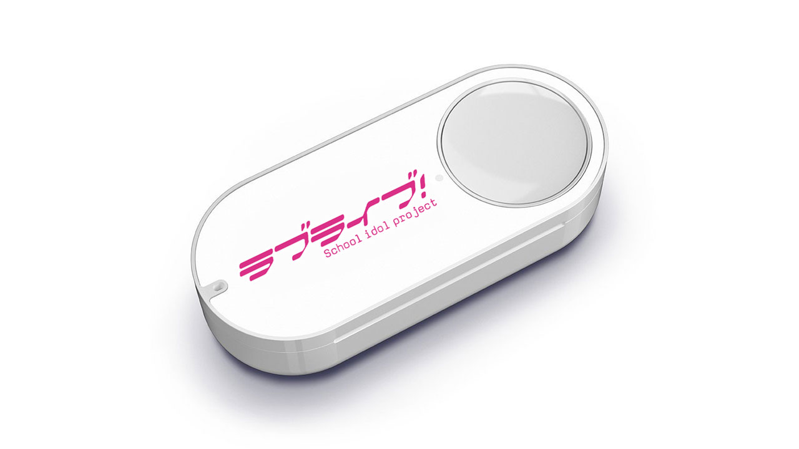

# START:DASH!! Button

## Description

登録した Amazon Dash ボタンを押すと `video/` ディレクトリ以下にある動画を [Omxplayer](https://elinux.org/Omxplayer) でランダムに再生します。

## Introduction

* [社会を生き抜くためには「ラブライブ！ Dash Button」が必要だ](http://windyakin.hateblo.jp/entry/2017/12/25/223524)

## License

* [MIT License](LICENSE)

## Author

* windyakin ([GitHub](https://github.com/windyakin) / [Twitter](https://twitter.com/MITLicense))
